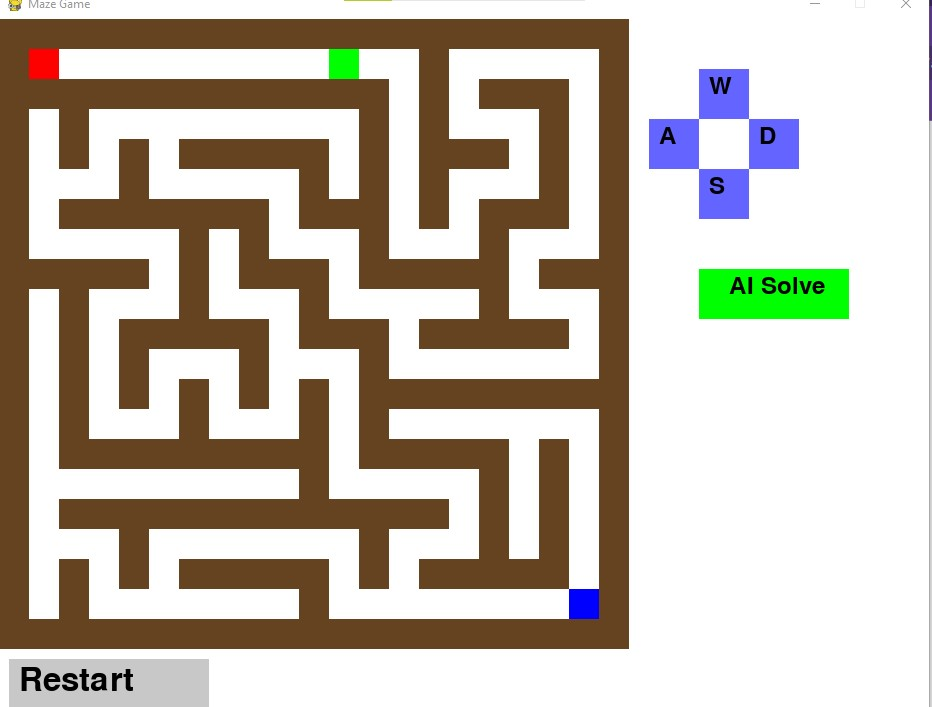
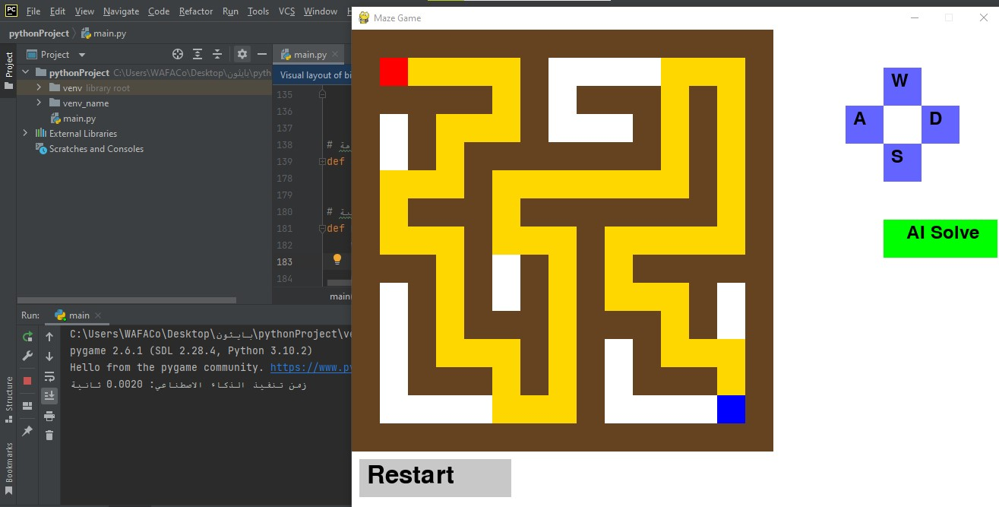
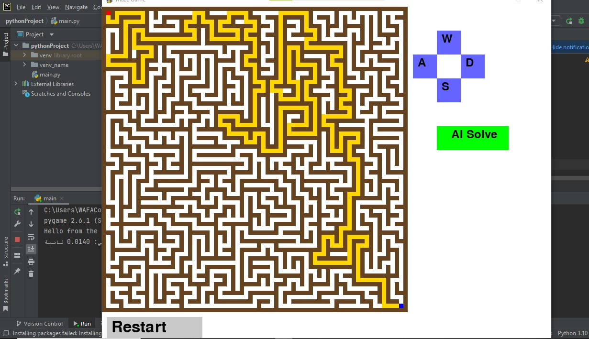

# 🌟 A* Maze Solver

📄 This repository contains a maze-solving project using the A* (A-star) pathfinding algorithm.

👉 **Full project documentation:** [View PDF Report](Maze-AI-Report.pdf)

---

## 🧠 Highlights

- ✅ Implementation of the A* pathfinding algorithm.
- 🧩  Implement the (A* algorithm) to find the shortest path from the start to the goal.
- 🎯 Finds the shortest path from start to goal.
- 📊 Visual representation of the solution path.

---

## 📸 Screenshots

